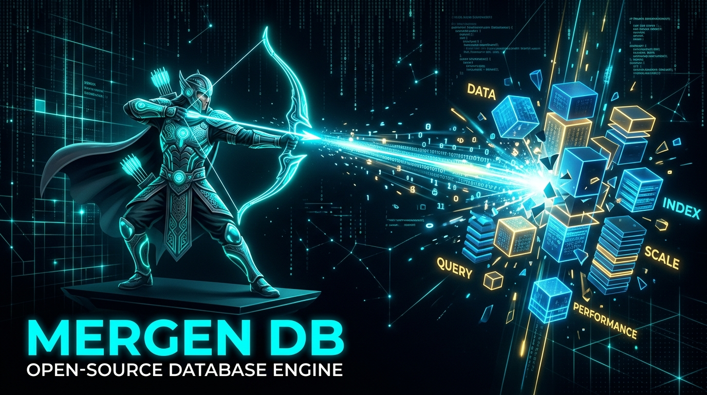
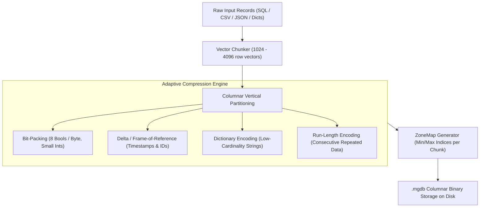

<p align="center">
  
</p>

# 🏹 MergenDB

<p align="center">
  <a href="https://pypi.org/project/mergendb/"></a>
  <a href="https://pypi.org/project/mergendb/"></a>
  <a href="https://github.com/ugurturkerkebeci/MergenDB/blob/main/LICENSE"></a>
  <a href="https://github.com/ugurturkerkebeci"></a>
  
</p>

> **"Big Data on Small Hardware"**  
> **MergenDB** is an ultra-compact, columnar, embedded database engine and custom query language (**MergenQL**) designed to run analytical workloads on resource-constrained systems (Raspberry Pi, IoT gateways, low-end VPS, and edge devices) with maximum compression, zero memory exhaustion, and blazingly fast execution.
>
> 👨‍💻 **Author & Lead Developer:** **Uğur Türker Kebeci** ([@ugurturkerkebeci](https://github.com/ugurturkerkebeci))

Named after **Mergen**, the ancient Turkic deity of wisdom, precision, and archery—who never misses his target.

---

## 📦 Installation

Install MergenDB directly from PyPI:

```bash
pip install mergendb
```

*(MergenDB has **zero external dependencies** for its core engine—runs out of the box on Python 3.8+!)*

---

## ⚡ Core Philosophy & Architecture

Traditional databases (MySQL, PostgreSQL, SQLite) store data in a **row-oriented** layout. If a table has 40 columns and you only query `temperature` and `room`, row-oriented engines must read all 40 columns from disk, wasting massive I/O bandwidth and RAM.

**MergenDB** redesigns storage from the silicon up:



### 1. 🗜️ Adaptive Hardware-Level Encodings
* **Bit-Packing:** 8 boolean values are packed into a single byte (**8x compression**).
* **Delta / Frame-of-Reference (FoR):** Art arda gelen ID'ler veya zaman damgalarında farklar saklanır (8-byte tamsayı yerine 1-2 byte).
* **Dictionary Encoding:** Tekrar eden metinler (status, category, city) 1-2 byte'lık ID tablolarına eşlenir.
* **Run-Length Encoding (RLE):** Art arda gelen aynı değerler tek bir sayaçla saklanır.
* **Adaptive Selection:** MergenDB her blokta en az yer kaplayan algoritmayı otomatik olarak tespit edip seçer.

### 2. 🎯 ZoneMap Indexing (Zero I/O Block Pruning)
Her veri bloğu minik bir `min_val` ve `max_val` üstverisi taşır. Eğer sorgunuz `WHERE temperature > 40` ise ve bloğun tavanı `35` ise, **MergenDB o bloğu diskten bile okumadan atlar**.

### 3. ✂️ Column Pruning
Tabloda 50 sütun olsa bile sorgunuz 2 sütun istediyse, kalan 48 sütun diskten **hiç okunmaz**. Disk I/O darboğazı %90+ oranında yok edilir.

### 4. 🌊 Vectorized & Chunked Streaming (Zero OOM)
Veriler 2048'lik dilimler (chunk) halinde boru hattından akar. **109 Milyonluk dev bir veritabanı bile 512 MB RAM'li küçük bir cihazda belleği patlatmadan (Out Of Memory olmadan) işlenir.**

---

## 📊 Benchmark: MergenDB vs SQLite vs JSON

Tested on **100,000 analytical telemetry records** (12 columns per row):

| Depolama Formatı | Disk Boyutu | Boyut Oranı | Alan Tasarrufu | Disk I/O Okuma |
| :--- | :--- | :--- | :--- | :--- |
| **JSON Lines (`.jsonl`)** | ~ 19.5 MB | 1.00x | %0.0 | ~ 19.5 MB |
| **Standard SQL (SQLite)** | 8.11 MB | 2.40x | %58.4 | 8.11 MB (Tüm tablo) |
| **MergenDB (`.mgdb`)** | **1.65 MB** | **11.80x** | **%91.5** | **0.29 MB (Sadece 2 sütun!)** |

> 🚀 **Sonuç:** MergenDB SQLite'tan **5 kat**, JSON'dan **12 kat daha küçüktür**. Analitik sorgularda diski **27 kat daha az** yorar!

---

## 📖 MergenQL & Komut Başvuru Kılavuzu (Cheat Sheet)

MergenDB'nin özgün sorgu dili **MergenQL**, verinin mantıksal olarak soldan sağa aktığı boru hattı (`|`) mimarisine dayanır.

### 1. Boru Hattı Aşamaları (Pipeline Stages)

| Komut | Açıklama | Örnek |
| :--- | :--- | :--- |
| `FROM` | Kaynak `.mgdb` dosyasını belirtir. | `FROM "telemetry.mgdb"` |
| `WHERE` | Satırları filtreler (ZoneMap uyumludur). | `\| WHERE temp > 30.0 AND room == "Lab"` |
| `COMPUTE` | Yeni hesaplanmış sütun üretir. | `\| COMPUTE temp_f = (temp * 1.8) + 32.0` |
| `SELECT` | Yansıtılacak sütunları seçer (Column Pruning). | `\| SELECT device_id, temp, temp_f` |
| `AGGREGATE` | Özet fonksiyonları çalıştırır. | `\| AGGREGATE avg(temp) AS ortalama BY room` |
| `SORT` | Sıralama yapar (`ASC` veya `DESC`). | `\| SORT ortalama DESC` |
| `LIMIT` | Sonuç satır sayısını sınırlar. | `\| LIMIT 10` |

### 2. Desteklenen Filtreleme Operatörleri (`WHERE`)
* **Karşılaştırma:** `==`, `=`, `!=`, `<>`, `<`, `<=`, `>`, `>=`
* **Mantıksal:** `AND`, `OR`
* **Metin Arama:** `LIKE` *(SQL `%` ve `_` joker karakterlerini destekler)*  
  *Örnek:* `| WHERE room LIKE "kit%"` veya `| WHERE email LIKE "%@gmail.com"`

### 3. Agregasyon Fonksiyonları (`AGGREGATE`)
* `count(*)` veya `count(col)`: Satır adedi
* `sum(col)`: Toplam
* `avg(col)`: Aritmetik ortalama
* `min(col)`: En küçük değer
* `max(col)`: En büyük değer
* `median(col)`: Medyan (ortanca) değer
* `stddev(col)`: Standart sapma

---

## 📥 SQL & phpMyAdmin Veritabanlarını İçe Aktarma

### 1. phpMyAdmin veya MySQL Dump Dosyalarını Aktarma (`.sql`)
phpMyAdmin'den dışa aktarılan `database.sql` dosyalarını tek satırda dönüştürün *(MySQL'e özel `ENGINE=InnoDB`, `AUTO_INCREMENT`, `LOCK TABLES` gibi fazlalıklar otomatik temizlenir)*:

```python
import mergendb

table = mergendb.from_sql_dump("phpmyadmin_dump.sql", "database.mgdb")
print(f"Toplam {table.row_count:,} satır MergenDB'ye aktarıldı!")
```

### 2. SQLite Veritabanlarını Aktarma (`.db`, `.sqlite`)
```python
table = mergendb.from_sqlite("legacy.db", "orders.mgdb", table_name="orders")
```

### 3. Canlı MySQL / PostgreSQL / Oracle Bağlantılarından Çekme
```python
import pymysql
from mergendb.io.importer import DataImporter

conn = pymysql.connect(host="localhost", user="root", password="", database="eticaret")
cur = conn.cursor()
cur.execute("SELECT * FROM siparisler")

DataImporter.from_cursor(cur, output_mgdb_path="siparisler.mgdb")
```

### 4. CSV Dosyalarını Otomatik Tip Algılama ile Aktarma
```python
table = mergendb.from_csv("sensor_data.csv", "sensor_data.mgdb")
```

---

## 💻 İnteraktif Terminal Kabuğu (REPL CLI)

Terminalden doğrudan MergenDB kabuğunu başlatın:

```bash
python -m mergendb.cli.repl
# veya
mergen
```

```text
  __  __                               _____  ____  
 |  \/  |                             |  __ \|  _ \ 
 | \  / | ___ _ __ __ _  ___ _ __     | |  | | |_) |
 | |\/| |/ _ \ '__/ _` |/ _ \ '_ \    | |  | |  _ < 
 | |  | |  __/ | | (_| |  __/ | | |   | |__| | |_) |
 |_|  |_|\___|_|  \__, |\___|_| |_|   |_____/|____/ 
                   __/ |                            
                  |___/   v0.2.0 (Edge Columnar Engine)

mergen> .info telemetry.mgdb
--- Storage Footprint: telemetry.mgdb ---
Total Rows           : 100,000
File Size on Disk    : 1.65 MB
Compression Ratio    : 11.80x (Saved 91.5% space)

mergen> .import sql backup.sql backup.mgdb
Successfully imported 250,000 rows in 320 ms

mergen> FROM "telemetry.mgdb"
   ...> | WHERE temp > 35.0 AND room LIKE "Server%"
   ...> | AGGREGATE avg(temp) AS ortalama, stddev(temp) AS sapma BY building
   ...> | SORT ortalama DESC
   ...> | LIMIT 5;
```

---

## 🧪 Test Paketini Çalıştırma

```bash
python -m unittest discover tests
```
*(Tüm 16 birim testi sıfır hata ile geçmektedir).*

---

## 👨‍💻 Yazar & İletişim

* **Geliştirici:** Uğur Türker Kebeci
* **GitHub:** [@ugurturkerkebeci](https://github.com/ugurturkerkebeci)
* **Proje Deposu:** [https://github.com/ugurturkerkebeci/MergenDB](https://github.com/ugurturkerkebeci/MergenDB)
* **PyPI:** [https://pypi.org/project/mergendb/](https://pypi.org/project/mergendb/)

## 📄 Lisans
Bu proje **MIT Lisansı** ile lisanslanmıştır. Açık kaynak dünyasına ve düşük donanımlı sistemlerde büyük veri analitiğine katkı sağlamak amacıyla geliştirilmiştir.
