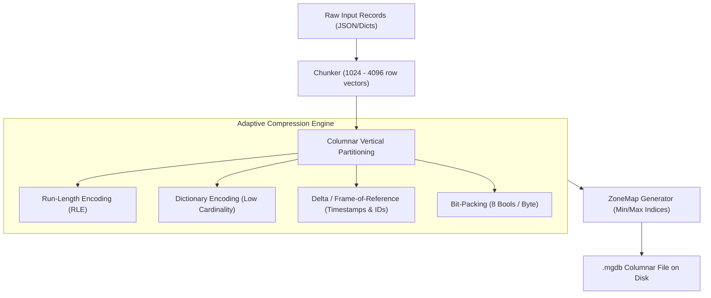

# 🏹 MergenDB

[](https://opensource.org/licenses/MIT)
[](https://www.python.org/downloads/)
[](#architecture)
[](#benchmark)

> **"Big Data on Small Hardware"**  
> **MergenDB** is an ultra-compact, columnar, embedded database engine and custom query language (**MergenQL**) designed to run analytical workloads on resource-constrained systems (Raspberry Pi, IoT gateways, low-end VPS, and edge devices) with maximum compression and zero memory exhaustion.

Named after **Mergen**, the ancient Turkic deity of wisdom, precision, and archery—who never misses his target.

---

## ⚡ Core Philosophy & Architecture

Traditional databases (SQLite, Postgres, MySQL) store data in a **row-oriented** layout. If a table has 50 columns and you only query `age` and `salary`, row-oriented engines must read all 50 columns from disk, wasting massive I/O bandwidth and memory.

**MergenDB** redesigns storage from the silicon up:



### 1. 🗜️ Adaptive Donut Compression (Hardware-Level Encodings)
* **Bit-Packing:** Booleans are packed 8 to a byte (8x space savings). Small integers use minimal bit-widths.
* **Delta / Frame-of-Reference (FoR):** Monotonically increasing timestamps or IDs store only differences (+1, +4), reducing 8-byte integers to 1 or 2 bytes.
* **Dictionary Encoding:** Repeated text and category strings are mapped to 1-2 byte integer IDs.
* **Run-Length Encoding (RLE):** Sequences of identical values are stored as a single `(value, count)` tuple.
* **Automatic Algorithm Selection:** MergenDB evaluates candidate encodings for each column block and selects the one with the smallest footprint.

### 2. 🎯 ZoneMap Indexing & Block Pruning
Every data block stores lightweight `min` and `max` metadata. During query execution, **blocks that cannot satisfy the query predicates are completely skipped without reading or decompressing bytes from disk**.

### 3. ✂️ Column Pruning
If a table has 40 columns and your query only asks for `temperature` and `room`, MergenDB seeks directly to those column offsets. **The other 38 columns are never read from disk.**

### 4. 🌊 Vectorized & Chunked Streaming
MergenDB processes data in vectorized chunks (e.g. 1024 values at a time). **A 50 GB database can be queried on a 256 MB RAM machine without Out-Of-Memory (OOM) errors.**

---

## 📊 Benchmark: MergenDB vs JSON vs CSV

Tested on **50,000 realistic IoT telemetry records** (`timestamp`, `device_id`, `building`, `room`, `temperature`, `humidity`, `voltage`, `status`, `is_alert`):

| Storage Format | Disk Size (KB) | Ratio vs JSON | Space Saved | Scan Time (50k rows) |
| :--- | :--- | :--- | :--- | :--- |
| **JSON Lines (`.jsonl`)** | 9,806 KB | 1.00x | 0.0% | ~ 240 ms |
| **Standard CSV (`.csv`)** | 3,751 KB | 2.61x | 61.7% | ~ 110 ms |
| **MergenDB (`.mgdb`)** | **599 KB** | **16.36x** | **93.9%** | **36 ms** |

> 🚀 **Result:** MergenDB is **16.3x smaller than JSON** and **6.2x smaller than CSV**, while executing analytical queries in **36 milliseconds**!

---

## 🏹 MergenQL: The Pipeline Query Language

MergenDB introduces **MergenQL**, a modern pipeline-oriented query language where data flows logically from left to right:

```text
FROM "telemetry.mgdb"
| WHERE temperature > 32.0 AND is_alert == true
| COMPUTE temp_f = (temperature * 1.8) + 32.0
| AGGREGATE count(*) AS alert_count, avg(temp_f) AS avg_f BY building
| SORT alert_count DESC
| LIMIT 10
```

---

## 🚀 Quickstart

### 1. Installation
Clone the repository and install in editable mode:
```bash
git clone https://github.com/your-username/MergenDB.git
cd MergenDB
pip install -e .
```
*(MergenDB has **zero external dependencies** for its core engine—runs on standard Python 3.8+!)*

### 2. Python API Example

```python
import mergendb

# 1. Define schema
schema = mergendb.Schema([
    mergendb.ColumnDef("id", mergendb.DataType.INT64),
    mergendb.ColumnDef("device_id", mergendb.DataType.STRING),
    mergendb.ColumnDef("temperature", mergendb.DataType.FLOAT64),
    mergendb.ColumnDef("building", mergendb.DataType.STRING),
    mergendb.ColumnDef("is_alert", mergendb.DataType.BOOL)
])

# 2. Create table and insert records
table = mergendb.create_table("telemetry.mgdb", schema, block_size=1024)

table.insert_many([
    {"id": 1, "device_id": "sensor_01", "temperature": 34.5, "building": "HQ", "is_alert": True},
    {"id": 2, "device_id": "sensor_02", "temperature": 21.0, "building": "HQ", "is_alert": False},
    {"id": 3, "device_id": "sensor_03", "temperature": 39.2, "building": "Factory", "is_alert": True},
])

# 3. Query using MergenQL
result = mergendb.query("""
    FROM "telemetry.mgdb"
    | WHERE is_alert == true
    | COMPUTE temp_f = (temperature * 1.8) + 32.0
    | SELECT device_id, building, temperature, temp_f
    | SORT temperature DESC
""")

print(result.display())
```

Output:
```text
+-----------+----------+-------------+--------+
| device_id | building | temperature | temp_f |
+-----------+----------+-------------+--------+
| sensor_03 | Factory  | 39.2        | 102.56 |
| sensor_01 | HQ       | 34.5        | 94.1   |
+-----------+----------+-------------+--------+
Returned 2 rows in 0.28 ms | Blocks: 1 scanned, 0 skipped (pruned) | Read: 0.14 KB
```

---

## 📥 SQL & Data Ingestion (İçe Aktarma)

MergenDB, mevcut veritabanlarınızı doğrudan ultra-kompakt `.mgdb` formatına dönüştürebilir:

### 1. SQLite Veritabanını İçe Aktarma
```python
import mergendb

# Tüm tabloyu veya özel bir SQL sorgusunun sonucunu dönüştürün:
table = mergendb.from_sqlite(
    sqlite_path="legacy.db",
    table_name="orders",
    output_mgdb_path="orders.mgdb"
)
```

### 2. SQL Dump Dosyasını (`.sql`) İçe Aktarma
Postgres/MySQL veya standart SQL dump dosyalarını doğrudan aktarın:
```python
table = mergendb.from_sql_dump(
    sql_dump_path="backup.sql",
    output_mgdb_path="products.mgdb"
)
```

### 3. CSV Dosyasını Otomatik Tip Algılama ile Aktarma
```python
table = mergendb.from_csv(
    csv_path="dataset.csv",
    output_mgdb_path="dataset.mgdb"
)
```

### 4. CLI / REPL Üzerinden İçe Aktarma
```text
mergen> .import sqlite legacy.db orders orders.mgdb
mergen> .import sql backup.sql products.mgdb
mergen> .import csv data.csv data.mgdb
```

---

## 💻 Interactive CLI / REPL

Launch the interactive MergenDB terminal shell:

```bash
python -m mergendb.cli.repl
# or if installed:
mergen
```

```text
  __  __                               _____  ____  
 |  \/  |                             |  __ \|  _ \ 
 | \  / | ___ _ __ __ _  ___ _ __     | |  | | |_) |
 | |\/| |/ _ \ '__/ _` |/ _ \ '_ \    | |  | |  _ < 
 | |  | |  __/ | | (_| |  __/ | | |   | |__| | |_) |
 |_|  |_|\___|_|  \__, |\___|_| |_|   |_____/|____/ 
                   __/ |                            
                  |___/   v0.1.0 (Edge Columnar Engine)

mergen> .info telemetry.mgdb
--- Storage Footprint: telemetry.mgdb ---
Total Rows           : 50,000
Total Blocks         : 25
File Size on Disk    : 599.40 KB (613,785 bytes)
Compression Ratio    : 16.36x (Saved 93.9% space)

mergen> FROM "telemetry.mgdb"
   ...> | WHERE temperature > 38.0
   ...> | AGGREGATE count(*) AS critical_count BY room
   ...> | SORT critical_count DESC;
```

---

## 🧪 Testing

Run the full automated test suite:
```bash
python -m unittest discover tests
```

---

## 🗺️ Roadmap
- [x] Columnar binary storage format (`.mgdb`) with headers and footers
- [x] Adaptive encodings (Bit-Packing, RLE, Dictionary, Delta/FoR, Raw)
- [x] ZoneMap min/max block pruning
- [x] Column projection pruning
- [x] MergenQL Lexer, Parser, and AST
- [x] Vectorized execution engine with aggregations and computes
- [x] Interactive REPL CLI
- [ ] Memory-mapped (mmap) zero-copy block loader
- [ ] Multi-threaded block scanner
- [ ] In-place B-Tree secondary indexing
- [ ] C extension / Rust bindings for SIMD bit-unpacking

---

## 📄 License
MIT License. Created for the open-source community to empower edge computing and low-resource data analytics.
